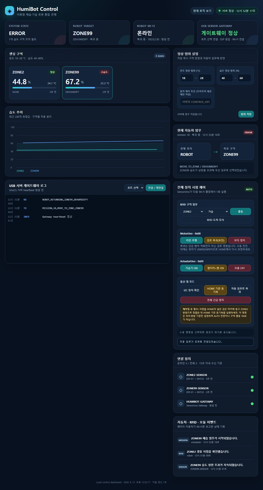
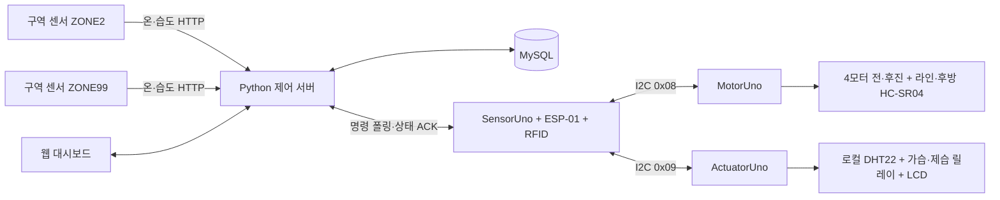

# HumiBot — 이동형 습도 제어 로봇

> 두 구역의 온·습도를 수집하고, 우선순위가 가장 높은 구역으로 이동해 가습 또는 제습 임무를 수행하도록 설계한 Arduino·Python 팀 프로젝트입니다.

[](https://github.com/oioihoihoih/mobile-humidity-control-robot/actions/workflows/ci.yml)



_합성 데이터로 렌더링한 관제 UI 예시입니다. 실차 왕복이나 고전력 가습·제습 부하의 성공 증거가 아닙니다._

## 프로젝트 한눈에 보기

- 고정 센서 노드 2대가 Wi-Fi로 구역별 온·습도를 전송합니다.
- Python 서버가 측정값과 임무 이력을 MySQL에 저장하고, 습도 편차와 지속시간으로 임무 우선순위를 계산합니다.
- 자동차는 `SensorUno`(서버·RFID·임무), `MotorUno`(4모터·라인·후방 초음파), `ActuatorUno`(로컬 DHT22·릴레이·LCD)로 역할을 분리합니다.
- 4모터 구동부는 차체를 돌리지 않고 전진·후진하며 하나로 이어진 검은 선을 추종하고, 주행 중 RFID로 중간·목표 구역을 확인합니다.
- 부팅 직후 위치를 추측하지 않습니다. HOME 마커에서 방향을 맞추고 `CALIBRATE_HOME`을 완료하기 전까지 주행을 차단합니다.
- 임무 완료 뒤에는 같은 측정값으로 액추에이터를 반복 가동하지 않고, 새로운 구역 측정을 기다립니다.

## 현재 검증 범위

| 범위 | 상태 | 의미 |
| --- | --- | --- |
| 서버·프로토콜·폐루프 회귀시험 | 자동 검사 제공 | `python scripts/check.py`로 소스 모델과 SimulIDE 계약을 검사합니다. |
| Uno 운영 스케치 | CI 컴파일 게이트 제공 | 분배 후 로컬 빌드는 SensorUno `27,190B / 1,396B`, MotorUno `11,446B / 468B`, ActuatorUno `15,452B / 554B`(flash/SRAM)이며, CI는 SensorUno `29,000B / 1,500B` 상한을 확인합니다. |
| 이전 3-Uno·2모터 벤치 기록 | 제한적 과거 증거 | 정지 상태의 연결, RFID→STOP→액추에이터와 안전 출력 기록이며 현재 M3/M4가 포함된 4모터 검증은 아닙니다. |
| 현재 4모터 하드웨어 | 미검증 | M1~M4 개별 방향·전류, 좌우 쌍, 전·후진과 후방 센서부터 바퀴를 띄운 상태에서 다시 검증해야 합니다. |
| 연속 라인·RFID 실차 왕복 | 미검증 | 서로 다른 기존 모터와 N20 1:298을 함께 쓰는 4모터 차체의 속도 정합, 전·후진 선 추종, 카드 판독과 제동거리를 트랙에서 검증해야 합니다. |
| 가습·제습 고전력 부하 | 미검증 | 전류·발열·퓨즈·방열과 실제 습도 변화량을 별도로 측정해야 합니다. |

자세한 증거 범위와 재현 명령은 [테스트 문서](docs/testing.md), 남은 위험은 [한계 문서](docs/limitations.md)를 확인하세요.

SensorUno와 MotorUno는 반드시 같은 커밋의 펌웨어를 함께 업로드합니다. 보정 시작 시 `PROTOCOL_SYNC(7)` exact ACK를 확인하고, 이동은 구형 값 `1/2`와 분리된 `0x11/0x12`만 사용합니다. 어느 한 보드가 구형이어도 반대 방향으로 움직이지 않고 주행이 잠깁니다.

## 시스템 구성



물리 경로는 `HOME → ZONE2 → ZONE99`의 직선형입니다. 구역 사이의 검은 선은 끊기지 않으며, ZONE2·ZONE99는 RFID로 식별하고 HOME만 넓은 검은 종점 마커로 확인합니다. 전체 상태 전이와 안전 조건은 [아키텍처 문서](docs/architecture.md)에 정리되어 있습니다.

## 빠른 시작

이 절차는 하드웨어를 움직이지 않는 로컬 서버 데모입니다. Python 3.12와 실행 중인 MySQL 서버가 필요합니다. 먼저 [설치 문서](docs/setup.md)에 따라 데이터베이스와 전용 `humibot` 계정을 만든 뒤 서버를 실행하세요. 관리자 계정이나 데이터베이스 자동 생성 권한을 상시 운영에 사용하지 않습니다.

```text
git clone https://github.com/oioihoihoih/mobile-humidity-control-robot.git
cd mobile-humidity-control-robot
python -m venv .venv
```

가상환경을 활성화한 뒤 의존성을 설치합니다.

```text
python -m pip install -r server/requirements.txt
```

PowerShell에서는 로컬 MySQL 접속값을 현재 셸에만 설정하고, USB 브리지를 끈 상태로 서버를 시작할 수 있습니다.

```powershell
$env:MYSQL_USER = "humibot"
$env:MYSQL_PASSWORD = "<mysql-password>"
$env:SERIAL_ENABLED = "0"
python server/server.py
```

브라우저에서 `http://127.0.0.1:8000`을 열고 다음 상태를 확인합니다.

- `/health`: 프로세스와 빌드 정보
- `/ready`: MySQL 연결 준비 상태
- `/logic`: 실행 중인 시스템 로직 문서

가상환경 활성화, 샘플 측정 전송, 펌웨어 설정과 신뢰 LAN 연결 방법은 [설치·실행 문서](docs/setup.md)를 따르세요.

## 저장소 구조

```text
.
├── firmware/                  # 운영·진단 Arduino/ESP 스케치
│   ├── uno_robot_esp01_rfid_relay/        # SensorUno
│   ├── uno_line_tracker_motor_controller/ # MotorUno
│   └── uno_humidity_module_controller/    # ActuatorUno
├── server/                    # Python 서버, 대시보드, 서버 단위시험
├── tests/                     # 3-Uno 프로토콜·폐루프 회귀시험
├── simulide/                  # 회로 프록시와 검증 도구
├── scripts/check.py           # 전체 오프라인 검사 진입점
└── docs/                      # 아키텍처·설치·API·검증 문서
```

현재 자동차 기준 소스는 위 3개 Uno 스케치입니다. 그 밖의 펌웨어는 구역 센서, 업로드·배선 진단 또는 이전 실험을 위한 보조 자료이므로 파일명과 각 폴더 문서를 확인한 뒤 사용하세요.

## 제어 로직 요약

기본 습도 범위는 환경 변수나 대시보드에서 바꿀 수 있습니다. 범위 아래는 `HUMIDIFY`, 범위 위는 `DEHUMIDIFY` 후보가 되며 우선순위는 다음과 같습니다.

```text
우선순위 = (임계값 초과 폭 × 100) + 위반 지속시간(분)
```

- 큰 편차가 먼저 선택되고, 편차가 같으면 오래 지속된 구역이 우선입니다.
- 습도 정상 복귀에는 기본 2%p 히스테리시스를 적용합니다.
- 신선한 위반 후보가 없는데 센서가 누락·stale 상태이거나 새 측정을 기다리는 중이면 `ALL_STOP`을 유지합니다.
- 모든 활성 구역이 신선하고 정상일 때만 `RETURN_HOME`을 만듭니다.
- 온도 범위 이탈은 경고로 표시하지만 온도 조절 임무를 생성하지 않습니다.

## 안전 및 네트워크 경계

- 이 시스템은 **격리되거나 신뢰할 수 있는 로컬 LAN의 교육용 프로토타입**입니다. 센서·상태 API에는 장치 인증과 TLS가 없으므로 인터넷에 직접 노출하거나 포트 포워딩하지 마세요.
- LAN에서 원격 제어를 사용할 때는 `CONTROL_API_TOKEN`을 설정해야 하지만, 이 토큰이 전체 API를 안전한 인터넷 서비스로 바꾸지는 않습니다.
- 모터, 펠티어, 팬의 전류를 Uno나 브레드보드로 공급하지 마세요. 별도 전원, 공통 GND, 퓨즈, 정격 드라이버와 방열 대책이 필요합니다.
- 첫 시험은 바퀴를 띄우고 고전력 부하를 분리한 상태에서 진행하세요. 소프트웨어 `ALL_STOP`은 물리 비상 정지 스위치를 대체하지 않습니다.

## 문서

- [문서 안내](docs/README.md)
- [시스템 아키텍처와 상태 흐름](docs/architecture.md)
- [하드웨어와 배선](docs/hardware.md)
- [설치와 실행](docs/setup.md)
- [HTTP API](docs/api.md)
- [테스트와 검증 범위](docs/testing.md)
- [현재 한계와 다음 검증](docs/limitations.md)
- [SimulIDE 사용법](simulide/THREE_UNO_PROXY.md)
- [문서·저장소 구성 참고 자료](docs/references.md)

버그나 기능 변경을 제안할 때는 재현 조건, 영향을 받는 보드·API, 실행한 검사 결과와 실물 여부를 함께 남겨 주세요. 검증되지 않은 실차 동작은 완료된 기능으로 표현하지 않습니다.

## 라이선스

팀의 오픈소스 라이선스가 아직 결정되지 않아 현재 `LICENSE` 파일이 없습니다. 공개 저장소라는 사실만으로 재사용·수정 권한이 부여되지는 않습니다. 팀 합의 후 목적에 맞는 라이선스를 선택하고 이 절을 갱신해야 합니다.
