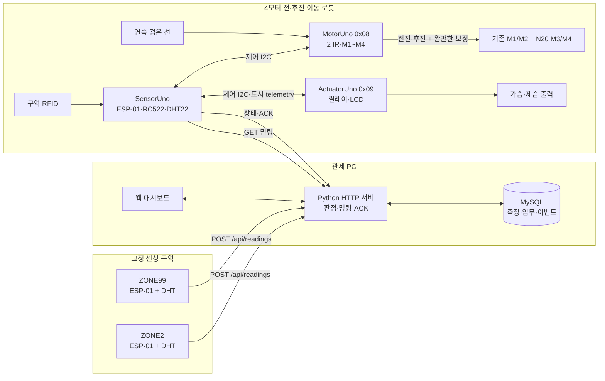
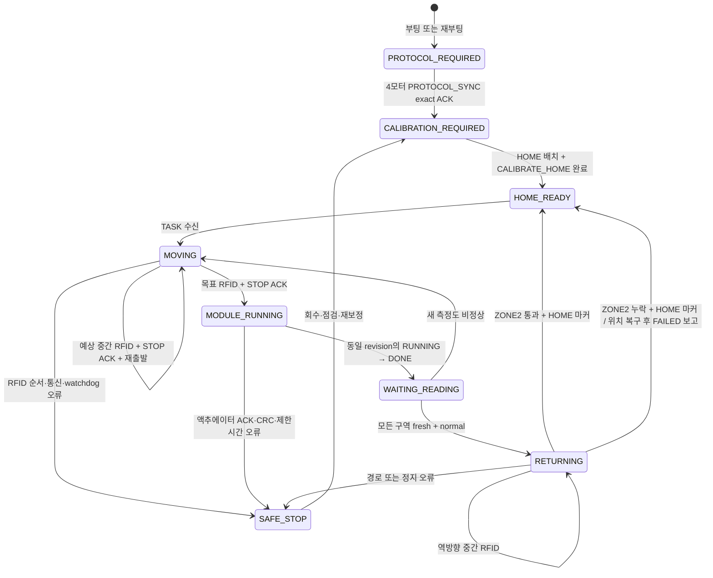

# 시스템 아키텍처

이 문서는 현재 운영 기준인 **2개 구역 센서, 3개 Uno 자동차, 4모터 전·후진 구동, 연속 검은 선과 RFID, Python/MySQL 서버**의 책임과 데이터 흐름을 설명합니다.

## 구성 요소



### 역할 분리

| 구성 요소 | 책임 | 실패 시 기본 동작 |
| --- | --- | --- |
| 구역 센서 노드 2대 | 고정 구역의 온·습도를 주기적으로 서버에 전송 | 최신값이 오래되면 서버가 해당 구역을 stale로 표시 |
| Python 서버 | 입력 검증, MySQL 저장, 습도 판정, 임무 revision과 관제 API 제공 | 신뢰할 새 입력이 없으면 새 동작을 만들지 않고 안전 정지 유지 |
| SensorUno | 서버 명령 폴링, 경로 상태, RFID 판독, MotorUno·ActuatorUno 조율, ACK 보고 | 위치·통신·ACK가 불명확하면 모터와 액추에이터 정지 요청 |
| MotorUno | 두 IR 센서로 연속 선을 추종하고 M1~M4를 전진·후진 및 좌우 감속 보정 | calibration 미완료, watchdog 만료, 잘못된 명령에서 네 모터 RELEASE |
| ActuatorUno | 가습·제습·팬 릴레이의 제한시간 동작과 LCD 표시 | 프레임·CRC·sequence 오류 또는 제한시간 종료 시 출력 OFF |
| MySQL | 측정, 최신 구역 상태, 임무, 설정, 장치와 이벤트 이력 저장 | 연결할 수 없으면 `/ready`가 실패하고 정상 서버 시작·판정을 신뢰하지 않음 |

선택형 USB/Wi-Fi 게이트웨이는 시리얼 로그와 연결 상태를 관제하는 보조 경로입니다. 구역 센서의 HTTP 입력과 자동차의 명령 폴링·ACK가 핵심 폐루프이며, USB 연결만으로 Wi-Fi나 서버 경로가 정상이라고 판단하지 않습니다.

## 물리 경로 모델

```text
[HOME 넓은 종점 마커] ===== 연속 검은 선 ===== [ZONE2 RFID] ===== [ZONE99 RFID]
```

- MotorUno의 두 IR 센서는 연속된 검은 선의 좌우 편차를 보정합니다.
- 출동은 차체 앞쪽 전진, 복귀는 차체를 돌리지 않는 후진입니다. 방향을 바꿀 때는 짧은 전체 RELEASE를 거치며 제자리 회전을 하지 않습니다.
- M1/M3은 왼쪽, M2/M4는 오른쪽으로 묶되 기존 축과 N20 1:298 후륜의 PWM은 따로 조정합니다.
- ZONE2와 ZONE99는 정지선이 아니라 주행 중 RC522가 읽는 RFID로 식별합니다.
- ZONE99로 가는 동안 ZONE2를 읽으면 중간 역으로 확정하고, 같은 태그가 판독 범위에서 벗어난 뒤 같은 방향으로 다시 출발합니다.
- 전진과 후진을 바꾼 직후에는 짧은 안정시간과 최소 한 번의 no-card 관측을 요구해 직전 RFID를 새 도착으로 재사용하지 않습니다.
- HOME은 RFID가 아니라 두 IR이 동시에 읽는 넓은 종점 마커입니다. 정상 복귀는 HOME 방향, ZONE2 통과 이력, 넓은 마커를 함께 사용합니다.
- 복귀 중 ZONE2 태그를 놓쳐도 HOME 마커에서 정지해 위치는 HOME으로 복구하지만, 임무는 성공이 아니라 `FAILED / HOME_RFID_MISSED`로 보고합니다.
- 트랙은 직선형 하나만 모델링합니다. 분기, 추월, 다중 로봇과 임의 구역 순서는 지원하지 않습니다.

HC-SR04는 N20 후륜 쪽을 바라보고 SensorUno D2/D3에 연결됩니다. 전진에서는
관측만 합니다. 후진 출발 전 최신 완료 sample이 없거나 `STUCK_HIGH`, 유효
거리 15cm 미만이면 출발을 거절합니다. 실제 후진 중에는 같은 두 위험 조건에서
PAUSE하고 18cm 이상을 3회 확인해야 RESUME합니다. `NO_ECHO`와
`OUT_OF_RANGE`는 넓은 공간일 수 있어 진단만 남기는 보조 기능입니다.

## 임무 상태 흐름



`CALIBRATE_HOME`은 위치 탐색 명령이 아닙니다. 사용자가 로봇을 HOME 마커 위에 놓고 차체를 ZONE2 방향으로 맞춘 뒤 실행하는 정지 상태 동기화입니다. 두 IR 센서는 HOME 마커를 확인할 수 있지만 차체가 실제로 어느 방향을 보는지는 판별하지 못합니다.

## 서버 판정 순서

1. 서버가 `ZONE2`, `ZONE99` 측정의 형식과 물리적으로 가능한 범위를 검사합니다.
2. 유효 측정을 `reading_log`에 추가하고 `zone_status`의 최신값과 측정 ID를 갱신합니다.
3. 습도 하한 미만은 `HUMIDIFY`, 상한 초과는 `DEHUMIDIFY` 후보가 됩니다. 온도 이탈은 경고만 만들고 액추에이터 임무는 만들지 않습니다.
4. 후보 우선순위는 `임계값 초과 폭 × 100 + 위반 지속시간(분)`입니다. 완전히 같은 점수면 구역 ID로 결과를 고정해 명령이 흔들리지 않게 합니다.
5. 신선한 위반 후보가 있으면 가장 높은 후보를 `TASK`로 선택합니다. 다른 구역이 stale이어도 이미 존재하는 신선한 위반을 무시하지 않습니다.
6. 신선한 위반 후보가 없고 누락·stale 구역 또는 아직 소비되지 않은 새 측정을 기다리는 구역이 있으면 `ALL_STOP`을 유지합니다.
7. 모든 활성 구역이 fresh·normal일 때만 `RETURN_HOME`을 만듭니다.

기본 stale 제한은 45초이고 습도 정상 복귀에는 기본 2%p 히스테리시스를 적용합니다. 두 값과 온·습도 임계값은 서버 환경 변수 또는 설정 API로 바꿀 수 있습니다.

## revision과 재가동 방지

서버 명령은 `revision`, `command`, `target_zone`, `action`의 네 필드로 자동차에 전달됩니다.

- 서버가 자동차에 실제 제공한 현재 revision과 자동차가 보고한 revision이 일치할 때만 ACK를 수용합니다.
- 자동 가습·제습은 해당 revision의 `TASK_COMPLETE / COMPLETED`가 수용되면 목표 구역의 최신 `reading_log.id`까지 소비 처리합니다.
- 완료 직후 명령은 안전 정지로 바뀌며, 같은 측정 행으로 같은 액추에이터를 다시 켜지 않습니다.
- 완료 뒤 도착한 새로운 측정도 여전히 비정상일 때만 새 revision의 임무를 발급합니다.
- 서버 재시작 뒤에도 이 측정 워터마크는 MySQL에 남아 이전 임무가 다시 실행되는 것을 막습니다.

## 로봇 내부 통신

| 경로 | 계약 |
| --- | --- |
| SensorUno ↔ MotorUno | 제어 I2C `0x08`; 명령과 sequence를 적용한 뒤 상태·명령·sequence ACK 반환 |
| SensorUno ↔ ActuatorUno | 제어 I2C `0x09`; magic·sequence·command·CRC 프레임과 일치하는 `RUNNING → DONE`만 완료 인정 |
| SensorUno → ActuatorUno | 자동차 DHT22와 상태를 담은 고정 길이 표시 telemetry |
| ActuatorUno → LCD | D5/D4의 별도 software-I2C; 3-Uno 제어 버스 A4/A5와 분리 |
| ESP-01 ↔ 서버 | 신뢰 LAN의 평문 HTTP; 명령 폴링, 상태 ACK, 센서 입력과 이벤트 |

LCD 오류는 표시 실패로만 격리하고 릴레이 안전 상태 머신과 분리합니다. MotorUno는 SensorUno의 유효 명령이나 keepalive가 끊기면 로컬 watchdog으로 정지합니다.

## 안전 불변조건

1. 부팅·재부팅 뒤 위치와 진행 방향을 추측하지 않습니다.
2. SensorUno와 MotorUno의 4모터 프로토콜 handshake가 일치하지 않거나 구형 이동값 `1/2`가 들어오면 모든 출력을 RELEASE하고 HOME 보정·주행을 열지 않습니다. 현재 이동값은 `0x11/0x12`입니다.
3. calibration 전에는 정지·keepalive·HOME 동기화 외 이동 명령을 실행하지 않습니다.
4. 예상한 다음 RFID만 위치 확정에 사용하며, 순서 밖 태그는 안전 정지 원인입니다.
5. 목표 구역에서는 MotorUno의 적용 ACK를 확인한 뒤에만 ActuatorUno 임무를 시작합니다.
6. 액추에이터 완료는 같은 command·sequence의 `RUNNING`을 먼저 보고 같은 tuple의 `DONE`을 본 경우만 인정합니다.
7. 센서가 stale이거나 완료 뒤 새 측정이 없으면 정상 복귀나 재가동을 추측하지 않습니다.
8. 소프트웨어 정지는 물리 비상 정지, 퓨즈, 전류 제한과 방열을 대체하지 않습니다.
9. 기존 모터와 N20 모터의 속도·정지전류가 다르므로 네 바퀴 동시 시험 전에 각 채널의 방향과 전류를 따로 확인합니다.

이 구조의 자동 시험 범위와 실물 증거 범위는 [테스트 문서](testing.md), 지원하지 않는 조건은 [한계 문서](limitations.md)를 확인하세요.
